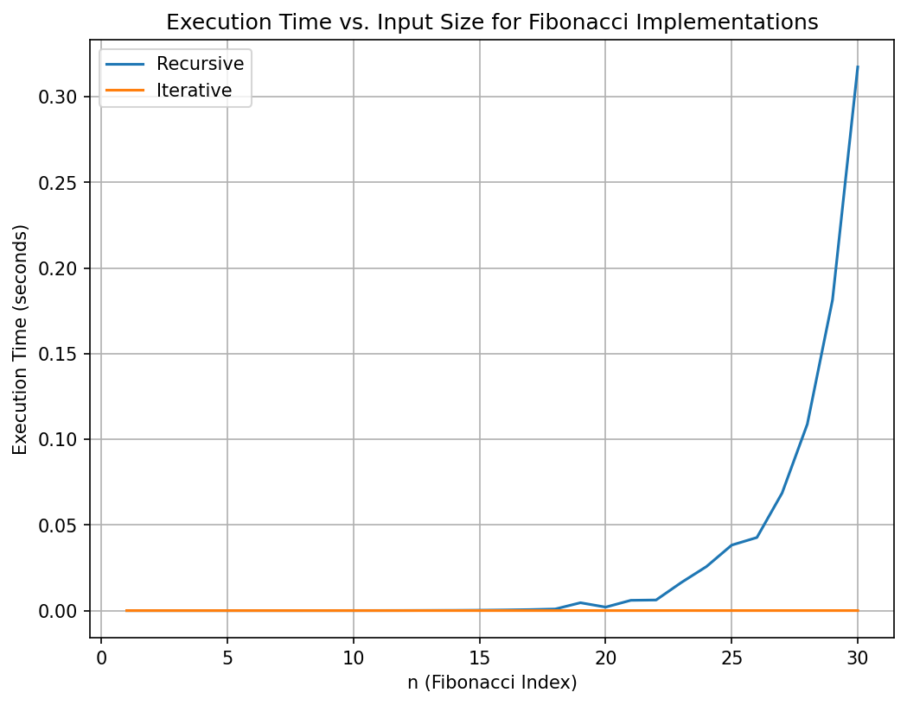
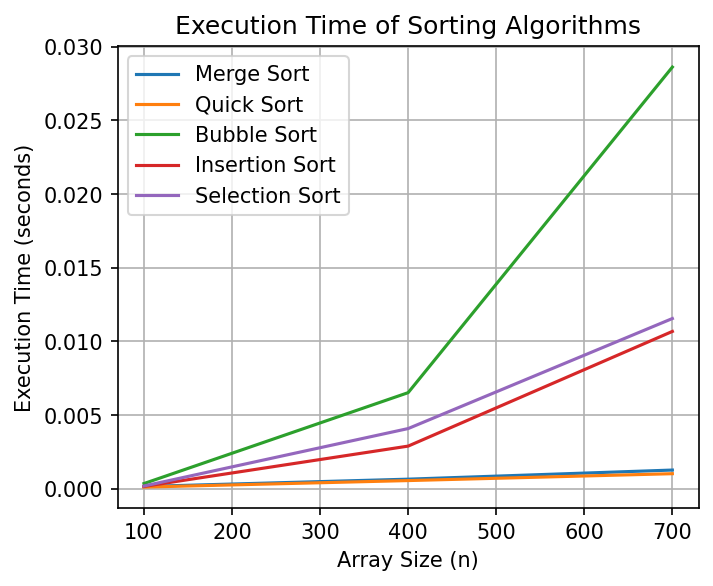
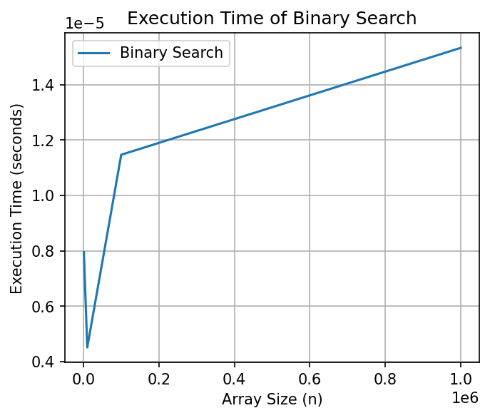

# Algorithm Efficiency Mini-Project

A hands-on analysis of common recursive and iterative algorithms with empirical timing and memory profiling. The project implements Fibonacci (naïve recursive and DP), Merge Sort, Quick Sort, Insertion Sort, Bubble Sort, Selection Sort, and Binary Search, then visualizes time and space behavior across input sizes with clear trade-offs and reflections.

## Project objectives
- Apply core algorithmic characteristics: finiteness, input/output, definiteness, effectiveness.
- Visualize time and space trade-offs with reproducible plots and profiling runs.
- Communicate algorithm behavior, recursive depth risks, and suitability for real workloads.

## Repository layout
- `algo_analysis_notebook.ipynb` — all implementations, benchmarks, plots, and analysis.
- `images` — exported figures from the notebook (PNG).
- `requirements.txt` — pinned minimal dependencies.
- `README.md` — this document.

## Setup
Create and activate a virtual environment:

```bash
# macOS/Linux
python -m venv venv && source venv/bin/activate

# Windows (PowerShell)
python -m venv venv; .\venv\Scripts\Activate.ps1
```

Install dependencies:

```bash
pip install -r requirements.txt
```

Launch Jupyter Notebook:

```bash
jupyter notebook
```

Then open `algo_analysis_notebook.ipynb`.

## How to run
In the notebook, **Run All** from top to bottom. This:

- Validates the environment and plotting.
- Defines all seven algorithms with docstrings and complexity notes.
- Benchmarks time and memory across input sizes for each algorithm.
- Saves figures with descriptive filenames.
- Prints a Markdown summary table of theoretical complexities.
- Provides reflections comparing observed vs expected behavior.

## Implemented algorithms
- Fibonacci: naïve recursive, dynamic programming (iterative rolling variables).
- Sorting: Merge Sort, Quick Sort, Insertion Sort, Bubble Sort, Selection Sort.
- Searching: Binary Search (iterative).

## Reproducible profiling
- **Time**: high-resolution monotonic timer for micro/millisecond measurements across input sizes with repeated runs; medians reduce variance.
- **Memory**: programmatic peak memory sampling during each function call; peak increment is reported per size to compare algorithms.
- **Optional deep-dive**: line-by-line memory in a script with targeted functions for explanations (not required to run standard plots).

## Plots generated

The notebook automatically generates and saves figures illustrating execution time vs input size for different algorithms:

### Fibonacci Implementations
  
*Recursive vs dynamic programming Fibonacci. Recursive execution grows exponentially, while the DP/iterative version remains linear and efficient.*

### Sorting Algorithms
  
*Execution time vs input size for Merge Sort, Quick Sort, Bubble Sort, Insertion Sort, and Selection Sort. Merge and Quick show O(n log n) scaling, while quadratic algorithms grow much faster.*

### Binary Search
  
*Execution time vs input size for iterative binary search. Growth is nearly flat even for very large n, aligning with O(log n).*

---

## Theoretical complexities

| Algorithm | Best time | Average time | Worst time | Space | Notes |
|---|---|---|---|---|---|
| Fibonacci (recursive) | O(2^n) | O(2^n) | O(2^n) | O(n) | Exponential calls; deep recursion |
| Fibonacci (DP/iterative) | O(n) | O(n) | O(n) | O(1) | Rolling variables; no recursion |
| Merge Sort | O(n log n) | O(n log n) | O(n log n) | O(n) | Stable; recursion depth O(log n) |
| Quick Sort | O(n log n) | O(n log n) | O(n^2) | O(log n) avg (stack) | Unstable; worst-case on bad pivots |
| Insertion Sort | O(n) | O(n^2) | O(n^2) | O(1) | Stable; good for nearly sorted/small n |
| Bubble Sort | O(n) | O(n^2) | O(n^2) | O(1) | Stable; early exit best case |
| Selection Sort | O(n^2) | O(n^2) | O(n^2) | O(1) | Not stable (basic); few swaps |
| Binary Search | O(1) | O(log n) | O(log n) | O(1) iterative | Requires sorted input |

---

## Suitability and trade-offs
- **Fibonacci**: recursive version is educational but impractical beyond small n; DP/iterative is linear-time with constant space and should be preferred in practice.
- **Merge vs Quick**: both scale roughly O(n log n); merge is stable with extra O(n) memory; quick is in-place on average with small constants but can degrade without good pivots.
- **Quadratic sorts**: insertion, selection, bubble are simple and in-place; insertion is best for small or nearly sorted data; selection minimizes swaps; bubble is mostly pedagogical.
- **Binary search**: extremely fast O(log n) lookups on sorted arrays; iterative form avoids recursion stack usage.

## Observed vs expected (what to note in analysis)
- **Time**: Merge and Quick follow O(n log n) trends; insertion dominates other quadratic sorts for nearly sorted inputs; binary search grows very slowly across orders of magnitude.  
- **Memory**: Merge’s peak memory grows with n due to merge buffer; in-place sorts show flat increments; DP Fibonacci stays nearly constant while recursion incurs stack growth.  
- **Recursion/stack**: naïve Fibonacci hits recursion limits quickly; quicksort depth can approach O(n) in worst cases; merge depth remains O(log n).

## File naming
- Figures are saved with descriptive filenames before display.
- Recommended DPI: **150** (quality vs size balance).  
- Use `bbox_inches='tight'` to trim margins.

## Re-running and reproducibility
- Random seeds are fixed for array generation.
- Timings are medians of repeated trials to reduce noise.
- Memory sampling interval can be tuned.

## Requirements
- Python 3.9+
- matplotlib, numpy, memory_profiler, jupyter

Install via:

```bash
pip install -r requirements.txt
```
